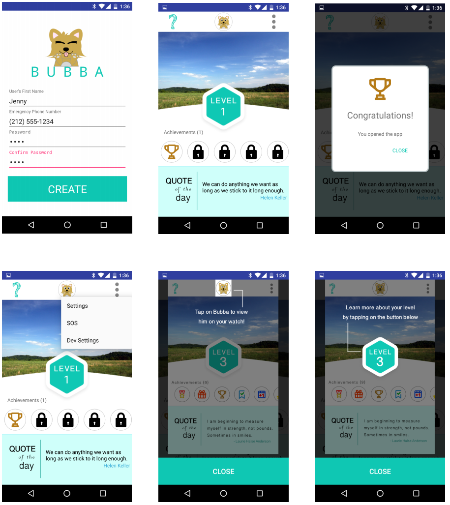
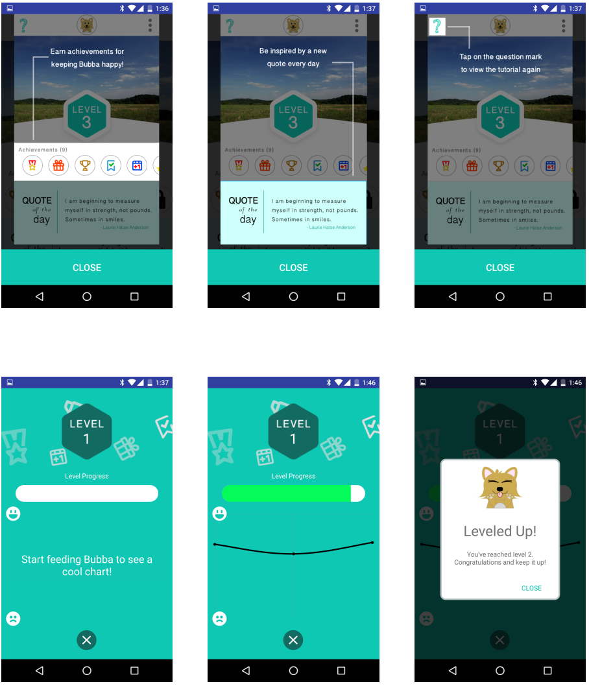
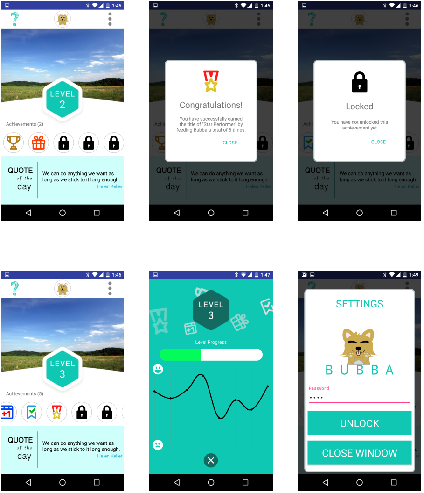
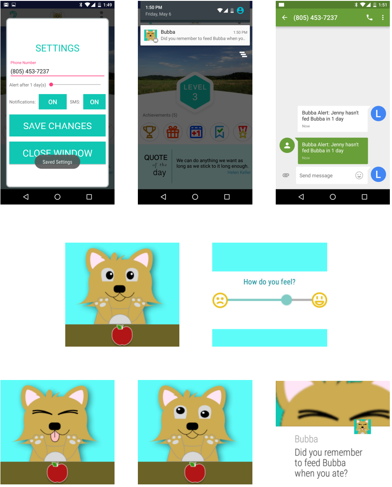
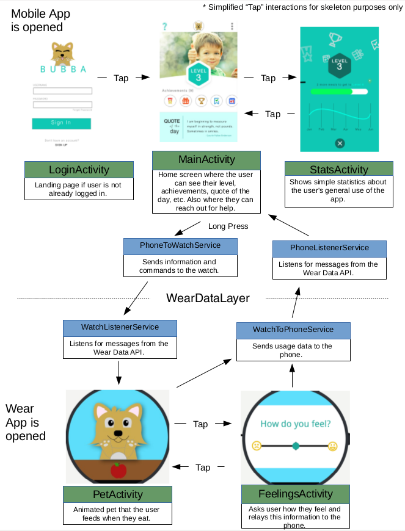

# Bubba (Android Wear App)

Our app, Bubba: The Happy Buddy, is a companion for young teens (12-16) with eating disorders such as anorexia or bulimia that aims to positively encourage healthy eating habits and non-intrusively track their eating patterns for their parents. 
When the user eats, they also feed their pet, Bubba, on the watch, who reacts happily and asks how they feel.
This data can be visualized on the phone application, which also has gamified elements such as a level system and achievements to encourage the user.
Parents are alerted if the child does not feed their pet in a few days.
"Bubba: The Happy Buddy" is our app, aimed at teens with eating disorders. Bubba, the pet, lives on your watch, and cutely encourages the user to follow healthy eating habits. The app also quietly tracks the user's eating patterns so any significant changes or many days without eating will alert the parent/guardian. On the phone side, the user can view fun data about their progress, such as their level, achievements and an inspirational quote of the day. Bubba, the happy buddy, is meant to accompany users on their way to healthy eating habits.

## Video [(Link)](https://www.youtube.com/watch?v=ApZMjMNgIwE)

## Poster [(Link)](https://drive.google.com/open?id=0B768S0QtfNoeWkc1MHg1Skd0Nms)

## Report [(Link)](https://drive.google.com/open?id=0B768S0QtfNoeZ3psc0RlMFNLNWM)

## Screenshots

## Basic Flowchart With Data Layer

