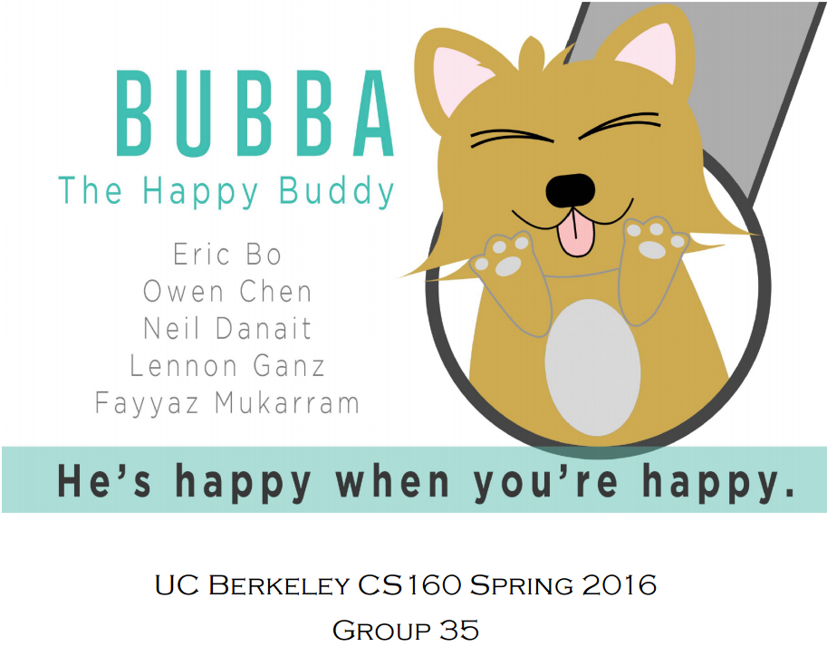

# Bubba (Android Wear App)

Group 35 Project

Eric Bo
Owen Chen
Neil Danait
Lennon Ganz
Fayyaz Mukarram

"Bubba: The Happy Buddy" is our app, aimed at teens with eating disorders. Bubba, the pet, lives on your watch, and cutely encourages the user to follow healthy eating habits. The app also quietly tracks the user's eating patterns so any significant changes or many days without eating will alert the parent/guardian. On the phone side, the user can view fun data about their progress, such as their level, achievements and an inspirational quote of the day. Bubba, the happy buddy, is meant to accompany users on their way to healthy eating habits.

## Video

[Bubba: The Happy Buddy](https://www.youtube.com/watch?v=ApZMjMNgIwE)

## Screenshots

## Basic Flowchart With Data Layer

